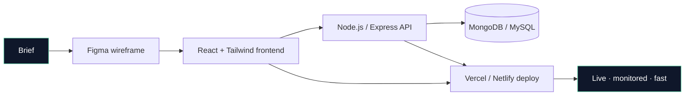

<p align="center">
  
</p>

<p align="center">
  
  <a href="https://github.com/Gokulraj002?tab=followers">
    
  </a>
  
  
  <a href="mailto:gokul.raj@ojiva.ai">
    
  </a>
</p>

---

### 🧭 About

```yaml
name:       Gokul
role:       Full-Stack Developer
based-in:   Bangalore, India
building:   Web experiences · Dashboards · CRMs
philosophy: "Boring reliability > shiny complexity."
reach:      gokul.raj@ojiva.ai
```

- 🔭 &nbsp;Currently building for **healthcare, real-estate & fintech** teams across India
- 🌱 &nbsp;Deepening my stack in **React, Node.js, Tailwind, and serverless deploys**
- ⚡ &nbsp;**78 repositories** and counting — shipping every week
- 🧠 &nbsp;Reading obsessively about frontend performance & clean architecture
- 📫 &nbsp;Fastest way to reach me → **[gokul.raj@ojiva.ai](mailto:gokul.raj@ojiva.ai)**

---

### 🌌 Skill Constellation

<p align="center">
  
</p>

---

### 🧩 How I ship (my usual stack)



---

### 📊 Activity Pulse

<p align="center">
  
</p>

<p align="center">
  
</p>

---

### 🐍 Contributions — this year

<p align="center">
  
</p>

---

### 📁 Recent Projects

| Project | Sector | Stack |
| :--- | :--- | :--- |
| **[Meghana Dental](https://github.com/Gokulraj002/meghana-dental)** | Healthcare | JavaScript · HTML · CSS |
| **[JK Residency](https://github.com/Gokulraj002/jk-residency)** | Hospitality / Real Estate | JavaScript · HTML · CSS |
| **[Sampurna Nivesh](https://github.com/Gokulraj002/sampurna-nivesh)** | Fintech | JavaScript · HTML · CSS |
| **[Sweety Cakes](https://github.com/Gokulraj002/Sweety-Cakes)** | Food & Beverage | HTML · CSS · JS |
| **[Invest Karnataka](https://github.com/Gokulraj002/investkarnataka)** | Government / Investment | HTML · CSS · JS |
| **[SST CRM](https://github.com/Gokulraj002/sstcrm)** | Internal Tool / CRM | HTML · JS |

---

### 🤝 Say hi

<p align="center">
  <a href="mailto:gokul.raj@ojiva.ai">
    
  </a>
  <a href="https://github.com/Gokulraj002">
    
  </a>
  <a href="https://www.linkedin.com/in/gokulraj002/">
    
  </a>
</p>

<p align="center">
  <sub>Bangalore, India · IST (UTC+5:30) · <a href="mailto:gokul.raj@ojiva.ai">gokul.raj@ojiva.ai</a></sub>
</p>

---

<p align="center">
  
</p>
