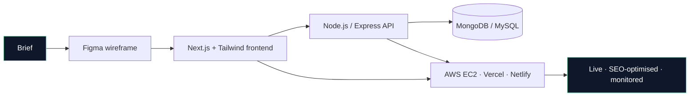

<p align="center">
  
</p>

<p align="center">
  
  <a href="https://github.com/Gokulraj002?tab=followers">
    
  </a>
  
  
  
  <a href="mailto:gokulrj002@gmail.com">
    
  </a>
</p>

---

### 🧭 About

```yaml
name:       Gokulraj V
role:       Full-Stack Developer & AI Automation Specialist
company:    Ojiva AI Technologies · Bengaluru
experience: 3 years · shipping to production
focus:      Next.js apps · AI voice agents · n8n & Make.com pipelines
building:   Web platforms · voice-first lead systems · CPaaS integrations
languages:  English · Tamil · Kannada · Telugu
philosophy: "Boring reliability > shiny complexity."
```

- 🎙️ &nbsp;Currently architecting **AI voice agent workflows** on Vapi.ai — enquiry → Airtable → agent call → CRM writeback
- 🧠 &nbsp;Deep in **Next.js, MERN, n8n, Make.com, AWS EC2, and CPaaS APIs** (WhatsApp Business · SMS · RCS)
- 🚀 &nbsp;**13+ production sites** shipped across healthcare, hospitality, fintech, sports, printing, and travel
- 🎓 &nbsp;B.Sc Computer Science · Mahendra Arts & Science College, Namakkal
- 📫 &nbsp;Reach me → **[gokulrj002@gmail.com](mailto:gokulrj002@gmail.com)** · **[linkedin.com/in/gokulraj002](https://linkedin.com/in/gokulraj002)**

---

### 🧠 What I actually do

| **Full-Stack Web** | **AI & Automation** | **Cloud & Growth** |
| :--- | :--- | :--- |
| Next.js SEO-first apps | AI voice agents (Vapi.ai, Ringg AI) | AWS EC2 + Elastic IP |
| React · Node · Express | n8n & Make.com workflows | CI/CD pipelines on GitHub |
| MERN stack CRUD | Airtable + CRM automation | Hostinger VPS + server ops |
| PHP · MySQL admin panels | WhatsApp Business API · SMS · RCS | WordPress · Magento 2 |
| Custom REST API design | Odoo automation | SEO · Google Ads · cold email |

---

### 🎙️ Signature Workflow — Live AI Voice Agent Pipeline

The system I architected at Ojiva AI: every website enquiry gets a real Vapi.ai voice call within seconds, gets qualified, and lands in the CRM. Watch it flow.

<p align="center">
  
</p>

Same qualification layer powers cold outbound at scale — Saleshandy · Apify · Apollo pipelines feed the same voice agent.

---

### 🌌 Skill Constellation

<p align="center">
  
</p>

---

### 🧩 Standard client build stack



---

### 📊 Activity Pulse

<p align="center">
  
</p>

<p align="center">
  
</p>

---

### 💼 Career Timeline

<p align="center">
  
</p>

---

### 🌐 Live Production Sites

| # | Project | Sector | Live URL | Stack |
| :--- | :--- | :--- | :--- | :--- |
| 1 | **Ojiva AI Technologies** | AI CPaaS (SMS · WhatsApp · RCS · Voice) | [ojiva.ai](https://www.ojiva.ai/) | Next.js · REST · SEO |
| 2 | **A2Z SMS** | Enterprise CPaaS (Meta Business Partner) | [a2zsms.in](https://www.a2zsms.in/) | Next.js · REST · SEO |
| 3 | **CWKL — Celebrity Women's Kabaddi League** | Sports platform (10 teams · 100+ players · 23 matches) | [cwkleague.com](https://www.cwkleague.com/) | PHP · MySQL · Custom admin |
| 4 | **JK Residency** | Hospitality (hotel booking) | [jk-residency.com](https://www.jk-residency.com/) | React · Mobile-first |
| 5 | **Meghana Multi-Speciality Dental Hospital** | Healthcare (Tirupati) | [meghanadental.in](https://www.meghanadental.in/) | Next.js · Technical SEO |
| 6 | **White Bird Digital Printing Press** | Printing / commerce | [whitebird.info](https://www.whitebird.info/) | React · Responsive |
| 7 | **Roam Traveller** | Travel blog + guides | [roamtraveller.com](https://roamtraveller.com/) | WordPress · Structured data |
| 8 | **Groavy Buildcon** | Construction / corporate | [groavy.com](https://www.groavy.com/) | React · Headless WordPress |
| 9 | **GS Silk Sarees** | E-commerce | [gssilksaree.com](https://gssilksaree.com/) | WooCommerce · Yoast · WP Rocket |
| 10 | **Sai Shishir Tours** | Travel agency | [saishishirtours.in](https://saishishirtours.in/) | WordPress · Elementor · SEO |

Plus internal builds — Student Management System (MERN), WhatsApp Marketing App (WABA + Meta Cloud API), Invoice & Maintenance CRM, Ojiva AI voice-agent workflow.

---

### 🐍 Contributions — this year

<p align="center">
  
</p>

---

### 🤝 Say hi

<p align="center">
  <a href="mailto:gokulrj002@gmail.com">
    
  </a>
  <a href="https://linkedin.com/in/gokulraj002">
    
  </a>
  <a href="https://github.com/Gokulraj002">
    
  </a>
</p>

<p align="center">
  <sub>Open to full-time roles in <b>full-stack development</b>, <b>AI integrations</b>, and <b>lead-generation systems</b>.</sub><br/>
  <sub>Bengaluru, India · IST (UTC+5:30) · replies within 24h</sub>
</p>

---

<p align="center">
  
</p>
