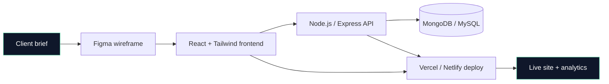

<p align="center">
  
</p>

<p align="center">
  
  <a href="https://github.com/Gokulraj002?tab=followers">
    
  </a>
  
  
  
</p>

---

### 🧭 About

```yaml
name:       Gokul
role:       Full-Stack Developer
based-in:   Bangalore, India
focus:      Building fast, reliable websites for
            clinics, real-estate, F&B and fintech clients.
philosophy: Boring reliability > shiny complexity.
```

- 🔭 &nbsp;Currently building websites for **healthcare, real-estate & fintech** clients
- 🌱 &nbsp;Deepening my stack in **React, Node.js, Tailwind, and serverless deploys**
- 💼 &nbsp;Open to **freelance projects** — landing pages, dashboards, CRMs, and web apps
- ⚡ &nbsp;Fun fact: I've shipped **10+ live client sites** in the last 12 months
- 📫 &nbsp;Reach me at **gokul.raj@ojiva.ai**

---

### 🛠️ Tech I use every week

<p>
  <b>Frontend</b><br/>
  
  
  
  
  
  
</p>

<p>
  <b>Backend</b><br/>
  
  
  
  
  
</p>

<p>
  <b>Tools & Deploy</b><br/>
  
  
  
  
  
  
</p>

---

### 🧩 How I build (my usual stack)



---

### 💼 Featured client work

| Project | Sector | Stack | Live |
| :--- | :--- | :--- | :--- |
| **[Meghana Dental](https://github.com/Gokulraj002/meghana-dental)** | Healthcare | JavaScript · HTML · CSS | — |
| **[JK Residency](https://github.com/Gokulraj002/jk-residency)** | Hospitality / Real Estate | JavaScript · HTML · CSS | — |
| **[Sampurna Nivesh](https://github.com/Gokulraj002/sampurna-nivesh)** | Fintech | JavaScript · HTML · CSS | — |
| **[Sweety Cakes](https://github.com/Gokulraj002/Sweety-Cakes)** | Food & Beverage | HTML · CSS · JS | — |
| **[Invest Karnataka](https://github.com/Gokulraj002/investkarnataka)** | Government / Investment | HTML · CSS · JS | — |
| **[SST CRM](https://github.com/Gokulraj002/sstcrm)** | Internal Tool / CRM | HTML · JS | — |

> Replace the — cells with live URLs once each project is deployed.

---

### 📊 GitHub in numbers

<p align="center">
  
  
</p>

<p align="center">
  
</p>

<p align="center">
  
</p>

---

### 🐍 My contributions this year

<p align="center">
  
</p>

---

### 🤝 Let's connect

<p align="center">
  <a href="mailto:gokul.raj@ojiva.ai">
    
  </a>
  <a href="https://github.com/Gokulraj002">
    
  </a>
  <a href="https://www.linkedin.com/in/gokulraj002/">
    
  </a>
  <a href="https://wa.me/91XXXXXXXXXX">
    
  </a>
</p>

<p align="center">
  <b>Need a website that actually loads?</b><br/>
  <sub>Available for freelance projects · IST (UTC+5:30) · Reply within 24h</sub>
</p>

---

<p align="center">
  
</p>
